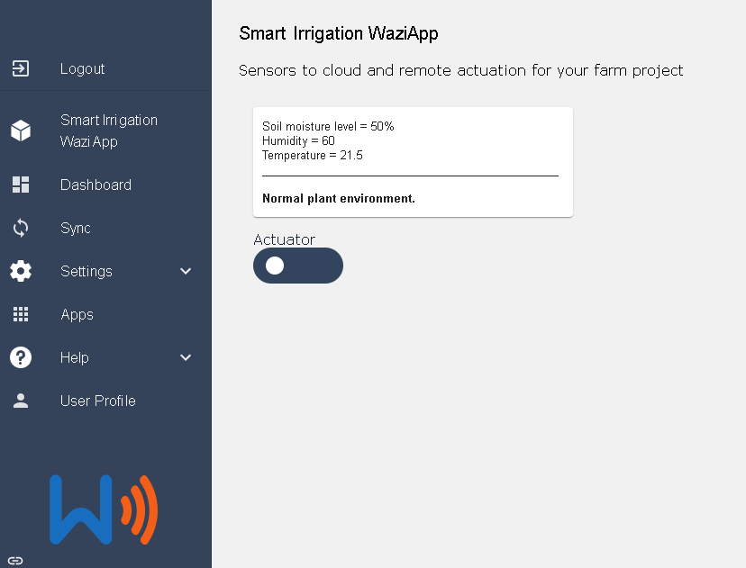

# Smart Irrigation WaziApp

## Description

This is a WaziApp that runs on the WaziGate. It gets sensor data of a specific device and also has a switch for actuator switching. Once the different sensor data of a device are obtained, we analyze them and display relevant insights on the WaziApp dashboard.

Link to GitHub Repository: [Waziup/smart-irrigation-waziapp](https://github.com/Waziup/smart-irrigation-waziapp)


## Quick Start

You first need to have WaziGate  setup . For instructions on how to do this, you can use Waziup’s tutorial from the [WaziApp course](https://www.waziup.io/courses/waziapps/). 

From the tutorial, the steps that you are required to carry out are under _Preparing  the development environment_ section. 

These are:
- Setup Wazigate firmware
- Setup communication channels
- Find WaziGate’s IP address
- IDE installation
- Install FTP on WaziGate

## Build the WaziApp

 ##### 1. Download the repository to your machine

``` 
git clone https://github.com/Waziup/smart-irrigation-waziapp
```
 ##### 2. SSH into the WaziGate ([Tutorial here](https://youtu.be/I746t7khNnk)) and navigate to the waziup repository


 ##### 3. Navigate to the repository

 ```
 cd waziup-gateway/apps/waziup 
 ```

 ##### 4. Create a new directory

 ```
  mkdir waziapp-smart-irrigation
  ```

  ##### 5. Create a new volume

  ``` 
 docker volume create waziapp-volume
 ```

 ##### 6. Create a new container, mount to repository the pulled image

 ``` 
 docker run -dit -P –-name pulled-waziup-container -v /home/pi/waziup-gateway/apps/waziup/waziapp-smart-irrigation waziup/smart-irrigation-waziapp
```
 ##### 7. Save the source image to current repository
 
 ``` 
docker cp XXX:/root/app/. .
 ```

## Structuring a WaziGate device data for the WaziApp

A device’s JSON needs to have sensors data of : soil moisture, humidity and temperature; in the listed order. Also, an actuator is needed to have been created from the dashboard. This requirement is so that the main.py can correctly obtain the 3 sensors from the JSON.

## Using the WaziApp

##### 1. First open docker-compose.yml and under volumes uncomment line:

```
- ./:/root/src/  # Uncomment for development
```

##### 2. Open Dockerfile and uncomment the line:

```
ENTRYPOINT ["tail", "-f", "/dev/null"]
```
 ##### 3. Open main.py. Change deviceID with your Device ID. Where XXXXX is the Device you want to get its sensor data.


 ##### 4. Open ui/toggle.js script. Here, change deviceID and actuatorID values with the IDs of the same device you used in main.py. Actuator ID is for the actuator of that device. These script makes POST requests which sets the actuator states: true or false.


 ##### 5. Build the container: 
 ``` bash
 docker-compose build
 ```
 ##### 6. Start the container in background: 
 ```bash
 docker-compose up -d
 ```

 ## View Data in WaziApp and make actions

 Once the WaziApp has been configured successfully and started, you can open the Smart Irrigation WaziApp on your gateway. You will see the sensor data, insights from the data and also and actuator switch which toggles your actuator to ‘true’ or ‘false’. These actuator states are sent back to the WaziDev/WaziAct/WaziGate as payloads. 

You can then control your motors, relays, solenoid, lamps or pumps; from the WaziApp!

